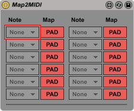

# Map2MIDI
A M4L patch for converting parameter mappings into MIDI messages.

To be used in conjunction with the "OSC TouchOSC" patch available in the Max For Live Connection Kit:
https://github.com/Ableton/m4l-connection-kit

# Instructions
To map a OSCKit/TouchOSC control using the "OSC TouchOSC" patch:

First, click the Map button and select a PAD button on the Map2MIDI patch.

Then, select the corresponding note to be played from the drop-down menu.

When a value of 1 or greater is recieved, the chosen MIDI note will play.
